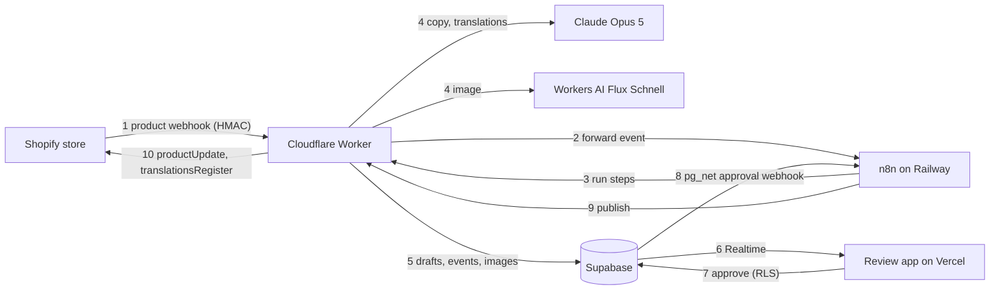
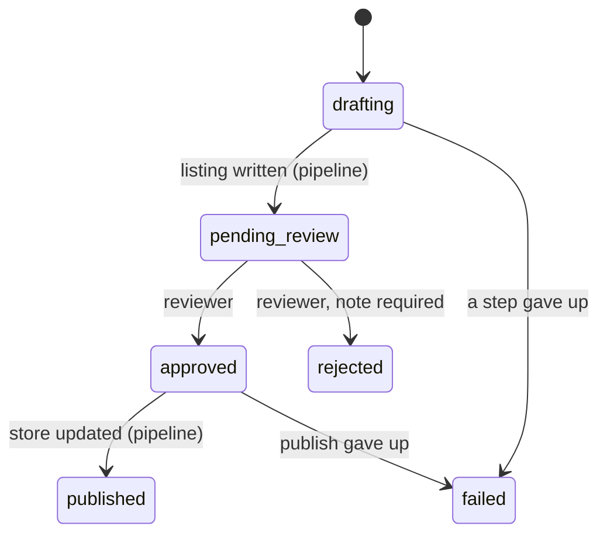

# Architecture

Draft turns a Shopify product into a reviewed listing in the brand's voice, in every brand
language, with a hero image, and writes it back to the store after a person approves it.

## Responsibilities

| Part                    | Owns                                                                                                                                     | Does not own                                               |
| ----------------------- | ---------------------------------------------------------------------------------------------------------------------------------------- | ---------------------------------------------------------- |
| Worker (`apps/worker`)  | All pipeline logic: webhook verification, ingest decisions, LLM and image calls, Storage uploads, Shopify writes, token cache, event log | Ordering and retries                                       |
| n8n (`n8n/workflows`)   | Step order, timeouts, retries, error routing, execution history                                                                          | Business rules, credentials for the store                  |
| Supabase (`supabase/`)  | Data, auth, access rules, status transitions, images, live updates, the approval hook                                                    | Anything that calls an LLM                                 |
| Review app (`apps/web`) | Reading the queue and drafts, editing, approving, rejecting                                                                              | A service key. It only ever acts as the signed-in reviewer |

## Pipeline steps

| Step      | Route                           | Idempotency                                                               |
| --------- | ------------------------------- | ------------------------------------------------------------------------- |
| Receive   | `POST /shopify/webhooks`        | HMAC checked with the app secret; non-2xx makes Shopify retry             |
| Ingest    | `POST /v1/shopify/products`     | Keyed on product id and `updated_at`; replays return the stored result    |
| Generate  | `POST /v1/drafts/:id/generate`  | Skips when content exists unless `force`                                  |
| Image     | `POST /v1/drafts/:id/image`     | Skips when an image exists unless `force`; daily cap                      |
| Translate | `POST /v1/drafts/:id/translate` | Only missing locales; merges rather than overwrites                       |
| Publish   | `POST /v1/drafts/:id/publish`   | Records `publish_hash` before writing; re-running writes the same content |
| Fail      | `POST /v1/drafts/:id/fail`      | Moves an in-flight draft to `failed`; otherwise only logs                 |

Every step writes a `pipeline_events` row with its duration and outcome.

## Ingest decision

`decideIngest` in `packages/shared` decides what a product webhook does:

1. Vendor has no brand: skip (`brand_unknown`).
2. Title and description hash equal the last published hash: our own write echoing back, skip
   (`echo_of_publish`). The hash ignores whitespace next to tags, because Shopify re-serialises
   list HTML when it saves.
3. Same content as the latest live draft: an edit to tags or stock, skip (`duplicate_source`).
4. A draft is mid-pipeline or approved: skip (`in_flight`).
5. Otherwise create the next version; a pending draft is superseded.

## Draft lifecycle

`private.enforce_draft_transition()` allows only these moves. A signed-in user can only move a
draft to `approved` or `rejected`; column grants limit reviewers to `status`, `content`,
`translations` and `review_note`. Nothing in code approves a draft.

## Security

- Row level security on every table, scoped by `brand_members` through `private.is_brand_member()`.
- `brand_secrets` (cached Shopify tokens) has RLS on and no policies: service role only.
- Storage objects live under `{brand_id}/…`; reviewers can read only their brands' folders.
- The Worker authenticates callers with a shared secret compared in constant time; Shopify
  webhooks with HMAC-SHA256 of the raw body.
- Error details sent by the orchestrator are reduced to status, code, name and message before
  they are stored, so request headers never reach the database.
- Secrets live in Wrangler secrets, Vercel env, n8n credentials, Supabase Vault and GitHub
  secrets. `secretlint` runs in the gate.

## Shopify connection

Dev Dashboard apps receive 24 hour tokens through the client-credentials grant. The Worker
requests them on demand and caches them in `brand_secrets`, refreshing ten minutes before
expiry. n8n never holds a store token. Webhooks are registered by the Worker
(`POST /v1/shopify/webhooks/register`) and point at the Worker.

## Known limits

- Image and translate run one after the other in n8n; running them in parallel would save
  about 7 seconds per product.
- Editing the default-language text does not re-translate; translations are made when the
  listing is written.
- Hero images stay in the review app; they are not uploaded to Shopify on publish.
- pg_net does not retry the approval webhook. A missed publish can be re-run by calling the
  publish route (see the runbook).
- One store, three brands mapped by vendor. Multi-store would move the domain from `brands`
  into a `stores` table.
- Reviewers sign in with email and password; there is no invite flow.
